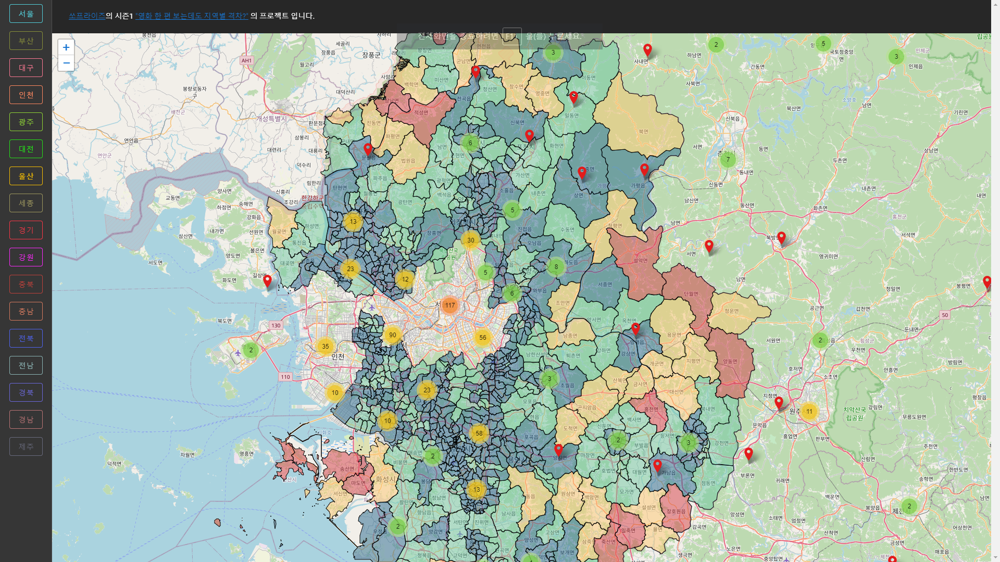

### 데이터 분석 python
- data_analysis
> data
> font
> 데이터탐색.ipynb

로 구성
#### 사용 라이브러리
- requests : 행정동 -> 위경도 변환 kakao api
- pandas,numpy : 데이터 분석
- haversine : 위경도 km 거리 계산

### 데이터 분석 및 시각화 vuejs
- viz-theater-map
- http://resional-theater-map-kr.s3-website.ap-northeast-2.amazonaws.com/
#### 사용 라이브러리
- vuejs
- vuetify
- leaflet.js
- vue2-leaflet-markercluster
- axios, vuex

